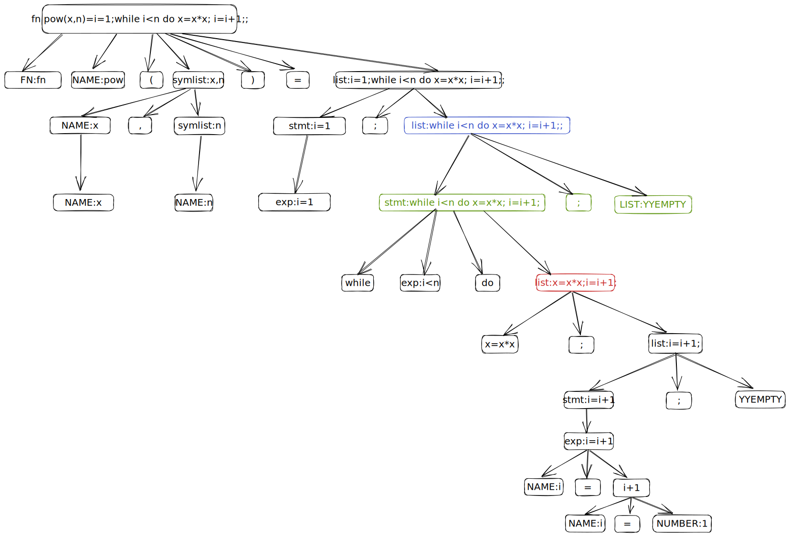

# references:

  * https://web.iitd.ac.in/~sumeet/flex__bison.pdf

    This book has some errors in it. Be careful!

flex manuaul: `info flex`

# debug

add

```c
#define YYDEBUG 1
int yydebug = 1;
```

in definition section of the bison grammar file.
Then, 

- build with gcc `-g` flag. 
- gdb breaks at `yyparse` function.


# AST pictures





